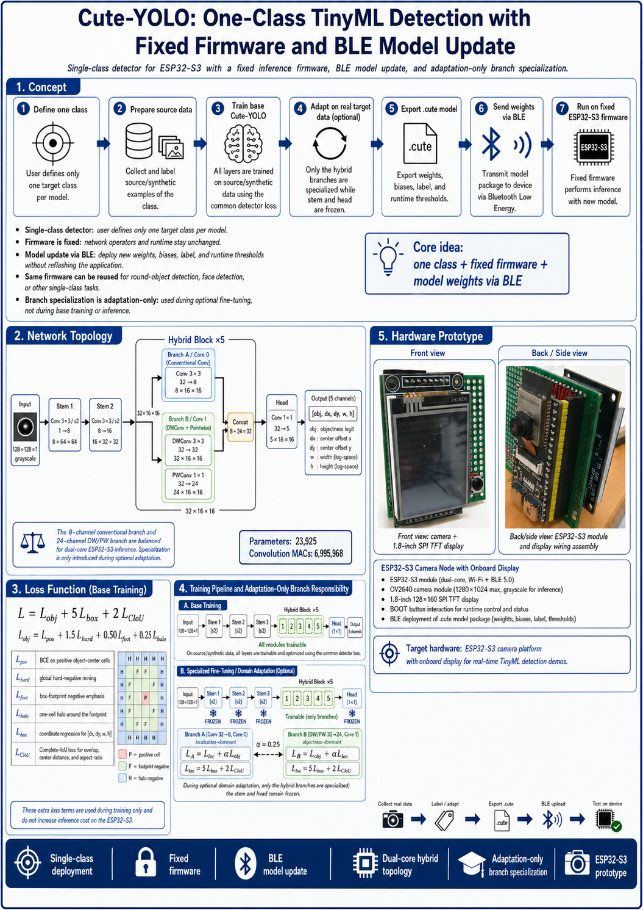

# Cute-YOLO

**Cute-YOLO** is a tiny **single-class object detector** designed for a dual-core **ESP32-S3 camera platform**.

<p align="center">
  
</p>

---

## Core idea

> **Flash the firmware once. Train new object classes later. Send only the model package over BLE.**

The ESP32-S3 keeps a fixed Cute-YOLO architecture and Noodle INT8 inference runtime.  
To change what the device detects, train the same network for a new single class and upload a new `.cute` model package.

```text
Choose one class
      ↓
Prepare images + bounding-box labels
      ↓
Train fixed Cute-YOLO in TensorFlow
      ↓
Full INT8 quantization
      ↓
INT8 confidence/NMS operating-point sweep
      ↓
Export model package
      ↓
Send .cute over BLE
      ↓
Same ESP32-S3 firmware, new detector
```

Examples:

```text
round_object.cute  ── BLE ──►  round-object detector
face.cute          ── BLE ──►  face detector
hand.cute          ── BLE ──►  hand detector
```

No firmware recompilation is required when only the detection class changes.

---

# What Cute-YOLO is

Cute-YOLO is intentionally small and specialized.

- **Single class per model**
- **128 × 128 grayscale input**
- **16 × 16 anchor-free output grid**
- Output per cell:

```text
[objectness, dx, dy, w, h]
```

- Fully INT8 inference with **Noodle**
- Dual-core execution on ESP32-S3
- Fixed network topology
- Replaceable weights and deployment parameters
- BLE model provisioning
- Raw-flash A/B model slots
- Flash memory mapping for model parameters
- Optional real-domain adaptation
- Post-quantization confidence/NMS calibration

The fixed topology is:

```text
Input: 1 × 128 × 128
        │
        ▼
Conv 3×3, s=2     1 → 8
        │
        ▼
Conv 3×3, s=2     8 → 16
        │
        ▼
Conv 3×3, s=2    16 → 32
        │
        ▼
┌──────────────────────────────┐
│ Hybrid block × 5             │
│                              │
│ Core 0: Conv 3×3   32 → 8    │
│                              │
│ Core 1: DWConv 3×3 32 → 32   │
│         PWConv 1×1 32 → 24   │
│                              │
│ Concat: 8 + 24 → 32          │
└──────────────────────────────┘
        │
        ▼
Conv 1×1           32 → 5
        │
        ▼
Output: 5 × 16 × 16
```

The architecture contains **23,925 trainable parameters** and approximately **6,995,968 convolution MACs**.

---

# Two demonstrated detection tasks

The same fixed architecture and ESP32-S3 firmware have been tested with two very different single-class tasks.

## 1. Round-object detection

The round-object experiment uses synthetic source data and optional real deployment-domain data.

It is useful for studying:

- repeated primitive objects,
- hard negatives,
- footprint and halo negatives,
- crowd-aware weighting,
- pseudo-objects formed by nearby repeated shapes.

## 2. Face detection

The face experiment uses **WIDER FACE** as the source dataset and real ESP32-S3 camera images for domain adaptation.

The current face recipe uses:

- Complex / distinctive object preset,
- hard-negative mining,
- minimum object size filtering at the 128×128 detector input,
- horizontal-flip augmentation with label re-encoding,
- brightness augmentation,
- contrast augmentation,
- CIoU or IoU overlap loss,
- strict INT8 conversion,
- INT8 confidence/NMS operating-point selection.

Real ESP32-S3 camera samples can then be used for optional domain adaptation.

This demonstrates that the same fixed Cute-YOLO firmware can support both:

```text
primitive / repetitive targets
and
complex / distinctive targets
```

without changing the deployed network topology.

---

# Repository layout

```text
Cute-YOLO/
│
├── README.md
│
├── dataset_examples/
│   ├── round_object/
│   └── face/
│
├── data_synthesizer/
│   └── ...
│
├── firmware/
│   └── ...
│
├── tools/
│   ├── cute_yolo_studio.py
│   ├── collect_cute_dataset.py
│   ├── cute_label_gui.py
│   ├── zip_to_cute.py
│   ├── pack_cute_model.py
│   └── upload_cute_ble.py
│
├── training/
│   └── ...
│
└── docs/
    ├── poster.png
    ├── Cute_YOLO_Studio_User_Manual.pdf
    └── ...
```

### Directory roles

| Directory | Purpose |
|---|---|
| `dataset_examples/` | Example source and real-domain datasets |
| `data_synthesizer/` | Synthetic dataset generation |
| `firmware/` | Fixed ESP32-S3 Cute-YOLO firmware |
| `tools/` | Studio, collector, labeler, packer, BLE uploader |
| `training/` | Training-related scripts/notebooks |
| `docs/` | Poster, manual, figures, documentation |

---

# Recommended workflow: Cute-YOLO Studio

The easiest way to use the project is through:

```bash
python tools/cute_yolo_studio.py
```

Cute-YOLO Studio contains four tabs:

```text
1. Train
2. Adapt to Real Data
3. Deploy via BLE
4. Log
```

The Studio performs the main pipeline:

```text
YOLO ZIP
   ↓
base training
   ↓
INT8 conversion
   ↓
INT8 operating-point sweep
   ↓
.cute
   ↓
optional real-domain adaptation
   ↓
adapted INT8 .cute
   ↓
BLE deployment
```

See the full manual in:

```text
docs/Cute_YOLO_Studio_User_Manual.pdf
```

---

# Quick Start

## 1. Define one object class

Choose one target category.

Examples:

```text
face
round_object
hand
bottle
electronic_component
```

Cute-YOLO is currently a **single-class detector**, so one `.cute` model represents one class.

---

## 2. Prepare a YOLO-format dataset ZIP

Cute-YOLO expects a standard single-class YOLO layout:

```text
dataset/
├── classes.txt
├── images/
│   ├── image_001.png
│   └── ...
└── labels/
    ├── image_001.txt
    └── ...
```

Each label line is:

```text
0 x_center y_center width height
```

with normalized coordinates in `[0,1]`.

If `classes.txt` is absent, Cute-YOLO Studio can use the fallback class name:

```text
X
```

### Source-data examples

For round-object detection:

```text
synthetic round-object ZIP
        ↓
Base Training
```

For face detection:

```text
WIDER FACE YOLO-format ZIP
        ↓
Base Training
```

---

## 3. Train the fixed model

Open the **Train** tab in Cute-YOLO Studio.

Choose:

- dataset ZIP,
- output folder,
- validation percentage,
- epochs,
- learning rate,
- batch size,
- training augmentation,
- object/loss preset,
- overlap loss.

The fixed detector loss is based on:

```text
L = L_obj + 5 L_box + 2 L_overlap
```

where `L_overlap` can be IoU or CIoU.

For the Complex / distinctive preset:

```text
L_obj = L_pos + 1.5 L_hard
```

For primitive / repetitive tasks, optional spatial-negative terms can also be enabled:

```text
L_obj =
    L_pos
  + 1.5 L_hard
  + 0.50 L_foot
  + 0.25 L_halo
```

with optional crowd-aware weighting.

---

# Training augmentation

Cute-YOLO Studio supports mild training-only augmentation:

```text
Horizontal flip    p = 0.50
Brightness         0.85–1.15
Contrast           0.85–1.15
Shuffle            each epoch
```

Horizontal flipping is label-safe.

The box geometry is mirrored first:

```text
x_center → 1 - x_center
```

and the 16×16 detector target is then re-encoded.

Brightness and contrast do not alter the box labels.

Validation data is not augmented.

---

# INT8 conversion and deployment calibration

After training, Cute-YOLO Studio performs strict INT8 TensorFlow Lite conversion.

The deployment operating point is then selected from the **actual INT8 model outputs**, not copied blindly from FP32 validation.

The Studio sweeps:

```text
confidence threshold
×
NMS IoU threshold
```

and selects the combination with the best validation F1 score, using mean IoU as a tie-break.

This is important because quantization and deployment-domain data can shift the useful confidence operating point.

The selected values are written into the final `.cute` package.

---

# Optional Domain Adaptation

Cute-YOLO can fine-tune a base detector using verified real deployment-domain data.

Typical workflow:

```text
Base model
+
original/source dataset
+
real ESP32-S3 labeled dataset
        ↓
mixed-domain adaptation
        ↓
INT8 conversion
        ↓
target-domain INT8 operating-point sweep
        ↓
adapted .cute
```

The default adaptation mix is:

```text
75% source/original data
25% real deployment-domain data
```

During specialized adaptation:

```text
Stem 1/2/3     FROZEN
Head           FROZEN

Hybrid A       TRAINABLE
Hybrid B       TRAINABLE
```

Branch A is localization-dominant:

```text
L_A = L_loc + 0.25 L_obj
```

Branch B is objectness-dominant:

```text
L_B = L_obj + 0.25 L_loc
```

with:

```text
L_loc = 5 L_box + 2 L_overlap
```

This specialization is used only during optional adaptation.  
The exported graph and ESP32-S3 firmware remain unchanged.

---

# Collecting real ESP32-S3 data

Use:

```bash
python tools/collect_cute_dataset.py /dev/ttyACM0
```

Dependencies:

```bash
python -m pip install pyserial pillow numpy
```

The collector communicates with the ESP32-S3 and saves the exact grayscale detector input together with current model predictions.

By default it creates:

```text
cute_real_dataset/
├── images/
├── labeled/
├── pseudo_labels/
└── metadata/
```

### Generated contents

`images/`

```text
clean 128×128 grayscale inputs
```

`labeled/`

```text
receiver-drawn preview images
```

`pseudo_labels/`

```text
current model detections in YOLO format
```

`metadata/`

```text
JSON metadata including:
- confidence
- inference time
- boxes
- label
- image dimensions
```

The collector uses the serial heartbeat:

```text
RDYSAMPLE
```

and each saved sample is triggered from the ESP32-S3.

> **Important:** pseudo-labels are model predictions, not verified ground truth.

They should be reviewed before domain adaptation.

---

# Verifying real data

Open the labeler:

```bash
python tools/cute_label_gui.py cute_real_dataset
```

The GUI can load the collector's pseudo-labels as a starting point.

You can:

- add boxes,
- delete boxes,
- clear boxes,
- verify negative frames,
- change the single-class name,
- save verified labels,
- export a standard YOLO ZIP.

Verified labels are written to:

```text
cute_real_dataset/labels/
```

Reviewed preview images are written to:

```text
cute_real_dataset/reviewed/
```

The final exported ZIP can be selected directly in the **Adapt to Real Data** tab.

---

# Convert an export ZIP manually

The Studio normally creates `.cute` automatically, but manual conversion is also available.

Use:

```bash
python tools/zip_to_cute.py model_export.zip
```

Optional deployment-only overrides:

```bash
python tools/zip_to_cute.py model_export.zip \
    --label face \
    --confidence 0.60 \
    --nms 0.25
```

The `.cute` package contains:

- INT8 weights,
- INT32 biases,
- requantization multipliers,
- requantization shifts,
- input/output quantization parameters,
- class label,
- confidence threshold,
- NMS IoU threshold,
- minimum box size,
- maximum detections,
- architecture identifier,
- CRC validation data.

The topology itself is not stored because the firmware already implements the fixed architecture.

---

# Fixed Firmware, Replaceable Model

This separation is central to Cute-YOLO.

## Firmware defines how inference runs

```text
camera
preprocessing
fixed network topology
Noodle INT8 operators
dual-core scheduling
decode
NMS
BLE model loader
TFT display
```

## `.cute` defines what the device recognizes

```text
weights
biases
requantization parameters
class label
confidence threshold
NMS threshold
box filtering parameters
```

Therefore:

```text
same firmware + round_object.cute = round-object detector

same firmware + face.cute         = face detector

same firmware + another.cute      = another detector
```

---

# Flash the ESP32-S3 firmware

The project uses **PlatformIO**.

Example:

```bash
pio run -e esp32-s3-camera-cute-ble -t upload
```

When changing to the raw Cute-YOLO A/B model partition table for the first time, erase flash once:

```bash
pio run -e esp32-s3-camera-cute-ble -t erase
pio run -e esp32-s3-camera-cute-ble -t upload
```

Monitor:

```bash
pio device monitor -b 921600
```

The firmware contains:

- ESP32-S3 camera interface,
- 1.8-inch SPI TFT preview,
- fixed Cute-YOLO topology,
- Noodle INT8 inference,
- dual-core scheduling,
- decoding and NMS,
- BLE model receiver,
- raw-flash model manager,
- A/B model slots,
- flash memory mapping.

---

# Hardware

The current prototype uses:

- ESP32-S3 camera board,
- camera module,
- 1.8-inch 128×160 SPI TFT,
- built-in BOOT button for runtime interaction,
- BLE for model deployment.

The TFT is initialized in landscape mode:

```text
160 × 128
```

The current SPI signal mapping is documented in the user manual.

---

# Send a model over BLE

Install:

```bash
python -m pip install bleak
```

Upload:

```bash
python tools/upload_cute_ble.py face.cute
```

or use the **Deploy via BLE** tab in Cute-YOLO Studio.

The deployment flow is:

```text
.cute
  ↓
BLE scan / connect
  ↓
upload to inactive slot
  ↓
verify
  ↓
activate
```

The ESP32-S3 validates the incoming package before activation.

---

# Raw Flash + Memory Mapping

Cute-YOLO does not need to copy the complete model parameter set into PSRAM.

The `.cute` package is stored in a raw flash partition.

After validation, the firmware memory-maps the active model and Noodle receives constant pointers into the mapped flash region.

```text
BLE
 ↓
raw flash partition
 ↓
memory map
 ↓
const pointers
 ↓
Noodle INT8
```

PSRAM remains primarily available for camera buffers and activation tensors.

Two model slots are used:

```text
cuteA
cuteB
```

A new upload is written to the inactive slot first, so an interrupted upload does not destroy the currently working model.

---

# Running Detection

The live camera preview is shown on the TFT.

Press the ESP32-S3 **BOOT button** to run inference.

The display can show:

```text
N=<number of detections>
T=<inference time>
```

The same firmware can immediately run whichever compatible `.cute` model is active.

---

# Why Noodle INT8?

Cute-YOLO does not require a special monolithic neural-network kernel inside Noodle.

The network is composed from existing Noodle primitives:

```text
Conv2D
Depthwise Conv2D
Concat
```

The heterogeneous hybrid block is executed as:

```text
Core 0:
    Conv2D

Core 1:
    Depthwise Conv2D
        ↓
    Conv2D  (1×1 pointwise)

        ↓
      Concat
```

The dual-core behavior is implemented at the application scheduling level.

Noodle:

https://github.com/auralius/noodle

---

# Typical end-to-end workflow

```text
                     COMPUTER
       ┌──────────────────────────────┐
       │ 1. Choose one class          │
       │ 2. Prepare source data       │
       │ 3. Train fixed network       │
       │ 4. Quantize to INT8          │
       │ 5. Sweep INT8 thresholds     │
       │ 6. Export .cute              │
       └──────────────┬───────────────┘
                      │
                      │ BLE
                      ▼
                   ESP32-S3
       ┌──────────────────────────────┐
       │ Fixed Cute-YOLO firmware     │
       │                              │
       │ .cute → raw flash            │
       │       → mmap                 │
       │       → Noodle INT8          │
       │       → detection            │
       └──────────────┬───────────────┘
                      │
                      ▼
              optional real data
                      │
                      ▼
       collect → verify labels → adapt
                      │
                      ▼
               adapted .cute
                      │
                      └──── BLE ────► ESP32-S3
```

---

# Current Status

The current fixed Cute-YOLO implementation has been physically tested on the ESP32-S3 with:

### Round-object detection

```text
synthetic source training
+
optional real-domain adaptation
```

### Face detection

```text
WIDER FACE source training
+
real ESP32-S3 camera-domain adaptation
```

For the face experiment, strict INT8 conversion preserved the detector well, and target-domain adaptation produced an ESP32-S3 deployment package that works directly at the automatically selected INT8 operating point.

This is the intended use of Cute-YOLO:

> **one fixed embedded detector architecture, retrained for different single-class tasks and updated over BLE without reflashing the firmware.**

---

# Documentation

See:

```text
docs/poster.png
docs/Cute_YOLO_Studio_User_Manual.pdf
```

The manual includes:

- Studio walkthrough,
- repository layout,
- tool descriptions,
- dataset format,
- hardware wiring,
- base training,
- domain adaptation,
- BLE deployment,
- troubleshooting.

---

## Cute-YOLO in one sentence

> **Choose one class, train the fixed network, quantize and calibrate it, then send the `.cute` model to the ESP32-S3 over BLE.**
